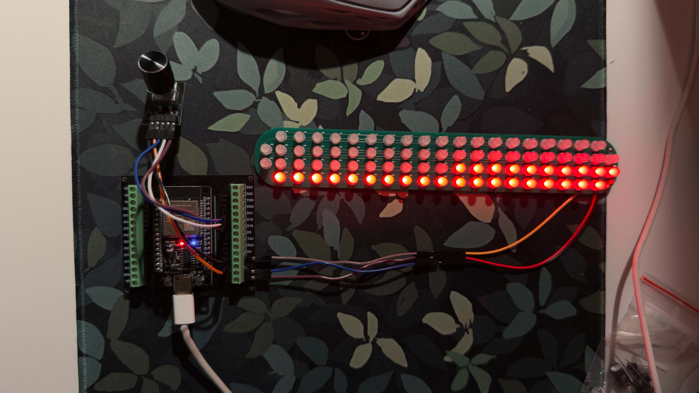
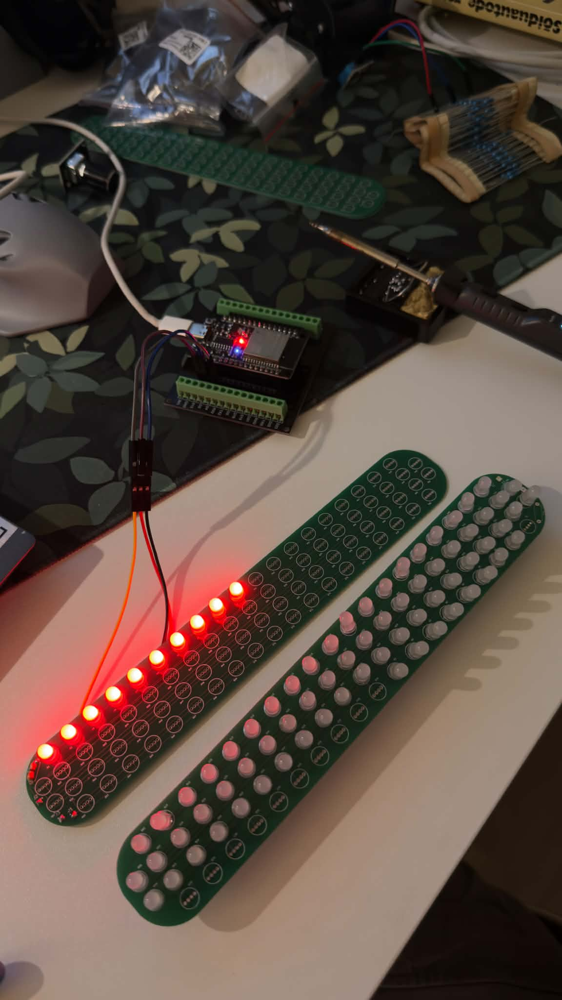

# Custom LED Fog Light for Project Car

## Overview

This is a custom LED fog light project for my project car.

The idea is to build a compact, programmable LED light module using an **ESP32**, **80 WS2812B addressable LEDs**, a **custom PCB**, and a **3D printed housing**.

The project is currently in the prototype stage. Right now I am testing LED control, Ways to make the PCB better, 3D design, and different light effects before building the final version.

> **Disclaimer:**
> This project is not intended for use on a road-legal car.
> It is being made for a show/project car and will not be used on public roads.

---

## Main Idea

Instead of using a normal fog light, this project uses individually controllable LEDs. This makes it possible to create different lighting modes, animations, startup effects, and show-style patterns.

The final version should include:

* normal fog light mode
* turn signal / indicator effects
* smooth fading animations
* startup animation
* japanese-style flashing effect 
* show-mode flashing effects
* maybe user interface

---

## Hardware Plan

Planned hardware for the project:

| Part                         | Purpose                              |
| ---------------------------- | ------------------------------------ |
| ESP32 Dev Module             | Main controller                      |
| 80x WS2812B LEDs             | Addressable light output             |
| Custom PCB                   | Clean LED and power connections      |
| Buck converter               | Steps car voltage down for the ESP32 |
| Protection diodes/capacitors | Protect against spikes and power loss|
| 3D printed housing           | Custom fog light enclosure           |
| Rotary encoder               | Prototype testing and manual control |

The housing will also be tested for waterproofness, because the final light module needs to handle outdoor/car conditions.

---

## Current Prototype

This is a test function to make sure the hardware and basic software work correctly.
It uses:

* ESP32 Dev Module
* rotary encoder with push button
* 80 WS2812B addressable LEDs
* FastLED library
* RotaryEncoder library

### Prototype test



## Wiring

| Component  | ESP32 Pin |
| ---------- | --------- |
| Rotary CLK | GPIO18    |
| Rotary DT  | GPIO19    |
| Rotary SW  | GPIO21    |
| Rotary +   | 3.3V      |
| Rotary GND | GND       |
| LED DIN    | GPIO5     |
| LED 3.3V   | 3.3V      |
| LED GND    | GND       |

### PCB Soldering


## Libraries

This project uses PlatformIO with these libraries:

```ini
lib_deps =
  mathertel/RotaryEncoder
  fastled/FastLED
```

---

## Project Goals

The main goals of this project are:

* learn and test ESP32-based LED control
* design a custom PCB for addressable LEDs
* build a custom 3D printed fog light housing
* test waterproofing and durability
* create different light modes and animations
* practice cleaner modular embedded programming


---

## Current Status

* [x] ESP32 test setup
* [x] rotary encoder input test
* [x] FastLED LED counter test
* [x] custom PCB design
* [ ] 3D printed housing
* [ ] waterproofing test
* [ ] final lighting mode programming
* [ ] car/project installation test

---

## Future Improvements

Planned next steps:

* add different lighting modes
* add turn signal animations
* add startup animation
* design the custom PCB combined with ESP32
* create the 3D printed housing
* test heat and waterproofing
* improve wiring and power protection


### 3D Model V2
